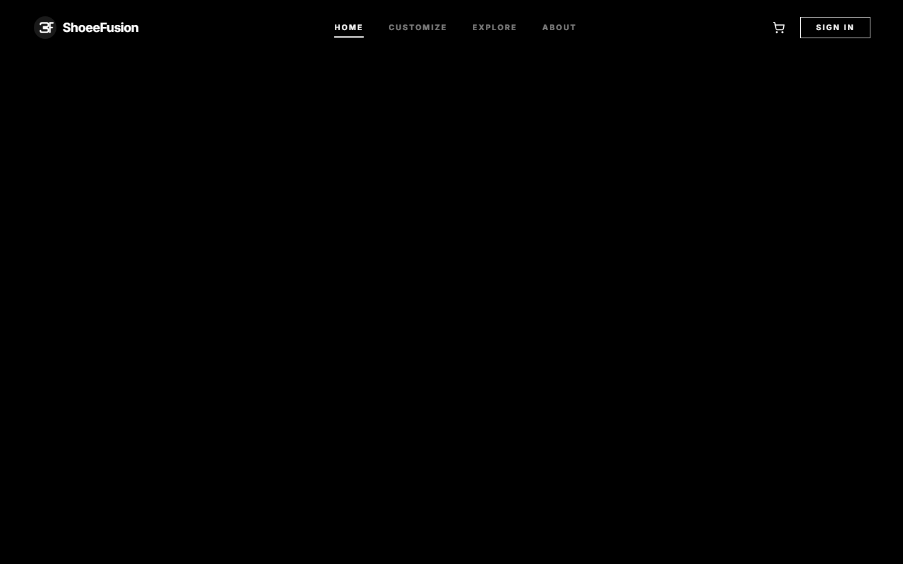
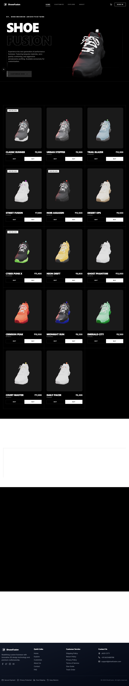

# ShoeFusion Remastered



ShoeFusion Remastered is a cutting-edge next-generation e-commerce platform pushing the boundaries of web experiences through an uncompromising Monochrome Brutalist aesthetic. The application utilizes a highly aggressive minimalist architecture, 
integrating 3D product visualization, high-fidelity UI constraints, and bleeding-edge front-end technologies to deliver a deeply immersive, zero-distraction fashion shopping experience.

## 📸 Screenshots
<div align="center">
  
  
</div>

## ✨ Signature Features
- **Monochrome Brutalism UI:** Strict black-and-white visual hierarchy driven purely by absolute contrast.
- **Real-Time 3D Rendering:** In-browser, interactable 3D shoe models leveraging `@react-three/fiber` and WebGL.
- **Dynamic Theming Override:** Architecturally decoupled shadow logic ensuring stark visual clarity and zero local-storage artifacting.
- **Supabase Backend:** High-performance data synchronization for personalized user collections and cart continuity.

## 🛠 Tech Stack
- **Framework:** Next.js (App Router)
- **Styling:** Tailwind CSS + Vanilla CSS Variables
- **3D Engine:** Three.js + React Three Fiber + GSAP
- **Database Backend:** Supabase (PostgreSQL)

## 📦 Getting Started

1. **Install dependencies:**
   ```bash
   npm install
   ```

2. **Environment Variables:**
   Obtain `.env.local` credentials. Do not commit these.
   ```
   NEXT_PUBLIC_SUPABASE_URL=your_url
   NEXT_PUBLIC_SUPABASE_ANON_KEY=your_key
   ```

3. **Run the local development server:**
   ```bash
   npm run dev
   ```
   Open [http://localhost:3000](http://localhost:3000)

## 🎨 Design Philosophy (Option A)
The platform fully migrated to "Monochrome Brutalism". There are no "warm" colors. Backgrounds are locked to absolute pitch black (`#000000`). Typography and UI boundaries are locked to brilliant white (`#FFFFFF`). Models default to pure white chassis layouts to guarantee brutal high-contrast visibility.

> *"If it doesn't contrast, it doesn't exist."*

<br/>

*Developed locally by Viraj.*
